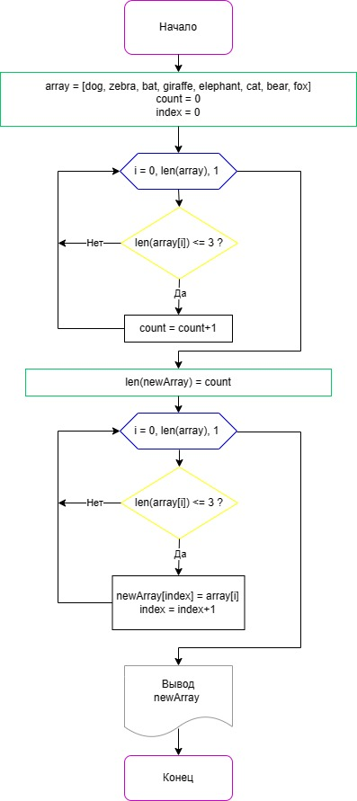

# Описание решения задачи

## I. Блок-схема



## II. Алгоритм

### 1. Блок инициализации 

У нас есть некий одномерный массив строчных данных array:
```
array = [dog, zebra, bat, giraffe, elephant, cat, bear, fox]
```
Задаем 2 переменные счетчика, для последующего использования в 2х циклах. Назовем их count и index:
```
count = 0
index = 0
```
### 2. Цикл для подсчета количества элементов, не превышающих 3 символов

Задаем цикл, используя пеоременную i, где стартовый элемент равен 0, конечный равен длинне оригинального массива array, а шаг цикла 1 на каждое новое повторение.
```
i = 0, len(array), 1
```

Внутри цикла прописываем условие: если длинна текущего значения элемента массива array[i] меньше или равна 3,
```
len(array[i]) <= 3 ?
```

то увеличиваем значение count на единицу.
```
count = count + 1
```
Таким образом, мы подсчитываем сколько элементов оригинального массива array имеют длинну меньше или равную 3м символам. Результатом станет значение переменной count.

### 3. Задаем новый массив для элементов, не превышающих 3 символов

Зададим новвый массив newArray, с количеством элементов count.
```
len(newArray) = count
```

Значение count, это количество элементов в оригинальном массиве array, длинна которых не превышает 3х символов, следовательно длинна нового массива newArray будет точно соответствовать количеству этих элементов, для дальнейшей их записи в созданный новый массив.

### 4. Цикл для записи в новый массив элементов, не превышающих 3 элементов

Задаем цикл, используя пеоременную i, где стартовый элемент равен 0, конечный равен длинне оригинального массива array, а шаг цикла 1 на каждое новое повторение.
```
i = 0, len(array), 1
```

Внутри цикла прописываем условие: если длинна текущего значения элемента массива array[i] меньше или равна 3,
```
len(array[i]) <= 3 ?
```

то, используя переменную index, записываем текущее значение оригинального массива array[i] в текущий элемент нового массива newArray[index]. После этого увеличиваем значение index на единицу.
```
newArray[index] = array[i]
index = index + 1
```
Таким образом происходит заполнение массива newArray только элементами, не превышающими 3 символов.

### 5. Вывод нового массива

Выводим наш новый массив newArray на экран. Он содержит только элементы меньшие или равные 3 символам.
Задача решена.
